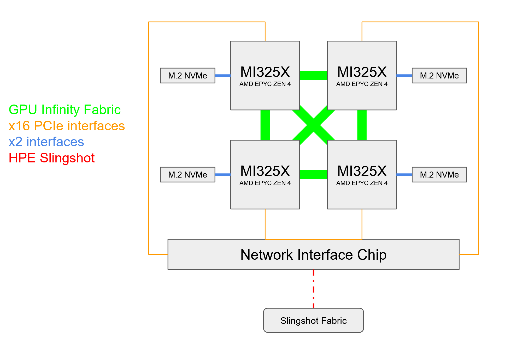

## Problem 4 (15 Points)

Find the current listing (64th) for the Top500 list for November 2024. Review the system architecture for each of the top 10 systems on this list. Provide a summary of trends that you find and discuss what kind of system you would design in the future so that it could be included in this impressive list. Make sure to provide a diagram of the architecture you would develop, and include details of the CPUs, memory and interconnect used. 

*Answers to this question should be included in your homework 1 write-up in pdf format.

***Top500 List:** https://www.top500.org/lists/top500/list/2024/11/ *

### Answers

**Listing #64: [SuperMUC-NG](https://www.top500.org/system/179566/)**

- **Architecture**: x86_64, Intel Xeon Platinum 8174 24C 3.1GHz
- **Interconnect**: Intel Omni-Path
- **Cores**: 305,856
- _Theoretical Peak Performance_: 26.87 PFlop/s

**Listing #1: [El Capitan](https://www.top500.org/system/180307/)**

- **Architecture**: x86_64, AMD 4th Gen EPYC 24C 1.8GHz, AMD INSTINCT MI300A
- **Interconnect**: Slingshot-11
- **Cores**: 11,039,616
- _Theoretical Peak Performance_: 2,746.38 PFlop/s

**Listing #2: [Frontier](https://www.top500.org/system/180047/)**

- **Architecture**: x86_64, AMD Optimized 3rd Generation EPYC 64C 2GHz, AMD INSTINCT MI250X
- **Interconnect**: Slingshot-11
- **Cores**: 9,066,176
- _Theoretical Peak Performance_: 2,055.72 PFlop/s

**Listing #3: [Aurora](https://www.top500.org/system/180183/)**

- **Architecture**: x86_64, Intel Xeon CPU Max 9470 52C 2.4GHz, Intel Data Center GPU Max
- **Interconnect**: Slingshot-11
- **Cores**: 9,264,128
- _Theoretical Peak Performance_: 1,980.01 PFlop/s

**Listing #4: [Eagle](https://www.top500.org/system/180236/)**

- **Architecture**: x86_64, Xeon Platinum 8480C 48C 2GHz, NVIDIA H100
- **Interconnect**: NVIDIA InfiniBand NDR
- **Cores**: 2,073,600
- _Theoretical Peak Performance_: 846.84 PFlop/s

**Listing #5: [HPC6](https://www.top500.org/system/180315/)**

- **Architecture**: x86_64, AMD Optimized 3rd Generation EPYC 64C 2GHz, AMD INSTINCT MI250X
- **Interconnect**: Slingshot-11
- **Cores**: 3,143,520
- _Theoretical Peak Performance_: 606.97 PFlop/s

**Listing #6: [Supercomputer Fugaku](https://www.top500.org/system/179807/)**

- **Architecture**: A64FX 48C 2.2GHz
- **Interconnect**: Tofu interconnect D
- **Cores**: 7,630,848
- _Theoretical Peak Performance_: 537.21 PFlop/s

**Listing #7: [Alps](https://www.top500.org/system/180259/)**

- **Architecture**: x86_64, NVIDIA Grace 72C 3.1GHz, NVIDIA GH200 Superchip
- **Interconnect**: Slingshot-11
- **Cores**: 2,121,600
- _Theoretical Peak Performance_: 574.84 PFlop/s

**Listing #8: [LUMI](https://www.top500.org/system/180048/)**

- **Architecture**: x86_64, AMD Optimized 3rd Generation EPYC 64C 2GHz, AMD INSTINCT MI250X
- **Interconnect**: Slingshot-11
- **Cores**: 2,752,704
- _Theoretical Peak Performance_: 531.51 PFlop/s

**Listing #9: [Leonardo](https://www.top500.org/system/180128//)**

- **Architecture**: x86_64, Xeon Platinum 8358 32C 2.6GHz, NVIDIA A100 SXM4 64 GB
- **Interconnect**: Quad-rail NVIDIA HDR100 InfiniBand
- **Cores**: 1,824,768
- _Theoretical Peak Performance_: 306.31 PFlop/s

**Listing #10: [Tuolumne](https://www.top500.org/system/180308/)**

- **Architecture**: x86_64, AMD 4th Gen EPYC 24C 1.8GHz, AMD INSTINCT MI300A
- **Interconnect**: Slingshot-11
- **Cores**: 1,161,216
- _Theoretical Peak Performance_: 288.88 PFlop/s

**Trends**:

- **CPU**: AMD and Intel CPUs are the most popular choices for the top systems.
- **Interconnect**: Slingshot-11 and NVIDIA InfiniBand are the most common interconnects.
- **GPU**: AMD INSTINCT and NVIDIA GPUs are the most common accelerators.
- **CPU**: The most common CPUs are AMD EPYC and Intel Xeon chips.
- **Cores**: The number of cores is increasing, with the top systems having millions of cores.
- **Performance**: Theoretical peak performance is in the range of hundreds to low-thousands of PFlop/s.

**Future System Design**:
If I were to design a system to be included in this list, I would most likely be using an APU-style architecture where the CPU and GPU share internal on-chip coherent interconnects. The CPU would be a high-core count AMD EPYC Zen 4 processor combined with a CDNA3 GPU architecture. Each APU would be connected to its own external High Bandwidth Memory (M.2 NVMe) and would be connected to each other via a high-speed interconnect like the AMD Infinity Fabric interface, allowing for a torus-connectivity topology. Each APU connects directly to a Network Interface Chip using HPE Slingshot interconnect to connect to the rest of the Slingshot Fabric network.

